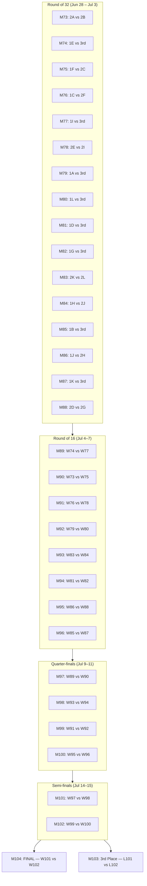
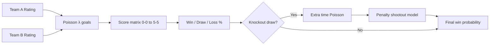
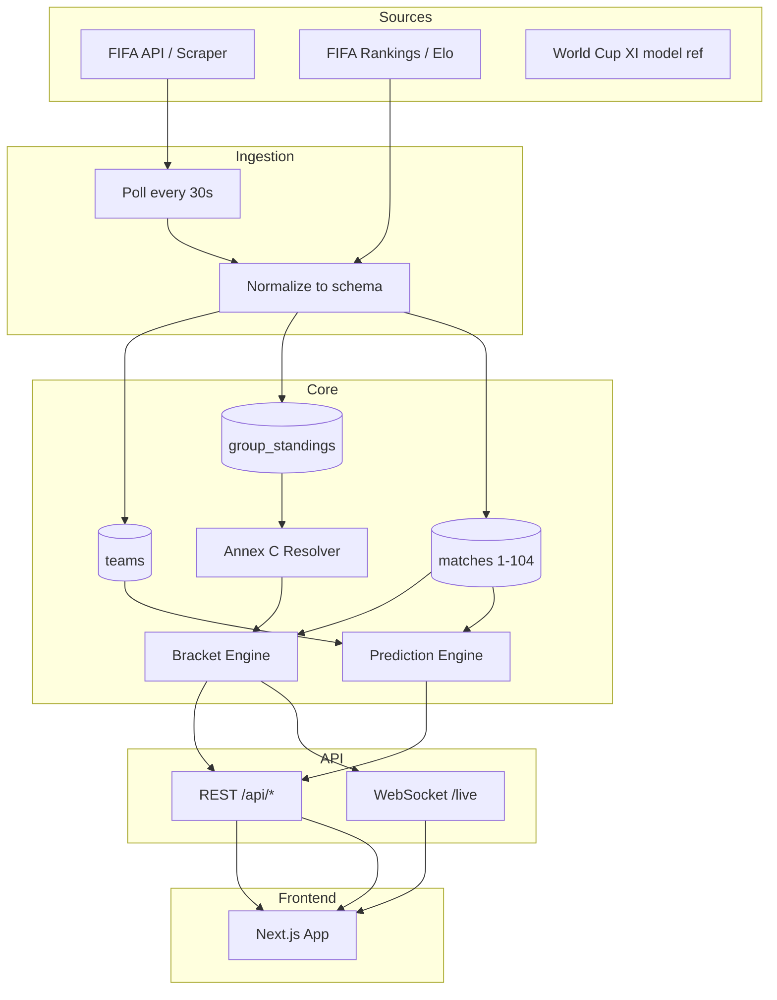

# FIFA World Cup 2026 — Chart Analysis & Application Plan

> **Note:** This chart covers the **FIFA World Cup 2026** national-team tournament (Canada, Mexico, USA hosts) — not the FIFA Club World Cup.

> **Data sources:** Your bracket chart, [World Cup XI](https://worldcupxi.com/bracket), [Wikipedia knockout stage](https://en.wikipedia.org/wiki/2026_FIFA_World_Cup_knockout_stage), and live standings as of **June 24, 2026**. The Google Share link did not resolve to usable data from automated fetch.

---

## 1. Chart Analysis

Your chart (Jorgemaat.com style) is a complete tournament map with three layers.

### Group Stage (48 teams → 12 groups A–L)

| Group | Teams |
|-------|-------|
| **A** | Mexico, South Africa, South Korea, Czechia |
| **B** | Canada, Bosnia & Herzegovina, Qatar, Switzerland |
| **C** | Brazil, Morocco, Haiti, Scotland |
| **D** | USA, Paraguay, Australia, Türkiye |
| **E** | Germany, Ivory Coast, Curaçao, Ecuador |
| **F** | Netherlands, Japan, Sweden, Tunisia |
| **G** | Belgium, Egypt, Iran, New Zealand |
| **H** | Spain, Cape Verde, Saudi Arabia, Uruguay |
| **I** | France, Senegal, Iraq, Norway |
| **J** | Argentina, Algeria, Austria, Jordan |
| **K** | Portugal, Uzbekistan, DR Congo, Colombia |
| **L** | England, Croatia, Ghana, Panama |

**Advancement rule:** Top 2 from each group (24) + **8 best 3rd-place teams** → **32 teams** enter knockouts.

**Tiebreak order:** Points → Goal Difference → Goals Scored → Fair Play → FIFA Ranking.

### Knockout Structure (Matches 73–104)



### Round of 32 — Official Slot Definitions

| Match | Home Slot | Away Slot |
|-------|-----------|-----------|
| M73 | Runner-up Group A | Runner-up Group B |
| M74 | Winner Group E | Best 3rd place Group A/B/C/D/F |
| M75 | Winner Group F | Runner-up Group C |
| M76 | Winner Group C | Runner-up Group F |
| M77 | Winner Group I | Best 3rd place Group C/D/F/G/H |
| M78 | Runner-up Group E | Runner-up Group I |
| M79 | Winner Group A | Best 3rd place Group C/E/F/H/I |
| M80 | Winner Group L | Best 3rd place Group E/H/I/J/K |
| M81 | Winner Group D | Best 3rd place Group B/E/F/I/J |
| M82 | Winner Group G | Best 3rd place Group A/E/H/I/J |
| M83 | Runner-up Group K | Runner-up Group L |
| M84 | Winner Group H | Runner-up Group J |
| M85 | Winner Group B | Best 3rd place Group E/F/G/I/J |
| M86 | Winner Group J | Runner-up Group H |
| M87 | Winner Group K | Best 3rd place Group D/E/I/J/L |
| M88 | Runner-up Group D | Runner-up Group G |

**Critical complexity:** 8 third-place slots use FIFA **Annex C** — a lookup table of **495 possible combinations** (12 choose 8). The app must implement this exactly, not guess pairings.

Reference: [FIFA World Cup 2026 Regulations (Annex C)](https://digitalhub.fifa.com/m/636f5c9c6f29771f/original/FWC2026_regulations_EN.pdf)

---

## 2. Current Tournament State (June 24, 2026)

Group stage is **in progress** (most teams have played 2 of 3 matches). Several teams have already qualified:

| Already through | Group |
|-----------------|-------|
| Mexico, USA, Germany, France, Argentina, Colombia | Various |
| Switzerland (won Group B over Canada) | B |
| Egypt (historic first WC win vs New Zealand) | G |

### Best 3rd-Place Race (top 8 qualify)

Per [World Cup XI](https://worldcupxi.com/bracket):

| Rank | Team | Group | Pts | GD | Status |
|------|------|-------|-----|-----|--------|
| 1 | Bosnia & Herzegovina | B | 4 | -1 | IN |
| 2 | Scotland | C | 3 | 0 | IN |
| 3 | Sweden | F | 3 | 0 | IN |
| 4 | Croatia | L | 3 | -1 | IN |
| 5 | Paraguay | D | 3 | -2 | IN |
| 6 | Algeria | J | 3 | -2 | IN |
| 7 | Iran | G | 2 | 0 | IN |
| 8 | Uruguay | H | 2 | 0 | IN |
| — | Czechia, Ecuador, Congo DR, Senegal | — | — | — | OUT |

Final group games (Jun 25–27) will lock the Round of 32 bracket.

---

## 3. Round of 32 Projections & Win Probabilities

Using the [World Cup XI Poisson model](https://worldcupxi.com/bracket) (squad strength + tournament form):

| Match | Fixture | Favorite | Win % | Key insight |
|-------|---------|----------|-------|-------------|
| **M73** | South Korea vs Canada | **Toss-up** | 50/50 | Host advantage vs Korea's form |
| **M74** | Germany vs Paraguay | **Germany** | 92/8 | Clear mismatch |
| **M75** | Japan vs Morocco | **Japan** | 53/47 | Tight — both solid |
| **M76** | Brazil vs Netherlands | **Netherlands** | 54/46 | Upset alert — very even |
| **M77** | France vs Sweden | **France** | 88/12 | Heavy favorite |
| **M78** | Ivory Coast vs Norway | **Norway** | 83/17 | Norway's group form strong |
| **M79** | Mexico vs Scotland | **Mexico** | 85/15 | Home crowd + Group A winner |
| **M80** | England vs Algeria | **England** | 80/20 | England favored despite draw vs Ghana |
| **M81** | USA vs Bosnia | **USA** | 94/6 | Host nation, Group D winner |
| **M82** | Egypt vs Uruguay | **Egypt** | 62/38 | Salah momentum after NZ win |
| **M83** | Portugal vs Ghana | **Portugal** | 87/13 | Ronaldo's Portugal heavy favorite |
| **M84** | Spain vs Austria | **Spain** | 85/15 | Spain's depth dominates |
| **M85** | Switzerland vs Iran | **Switzerland** | 78/22 | Group B winner in form |
| **M86** | Argentina vs Cape Verde | **Argentina** | 96/4 | Biggest mismatch of R32 |
| **M87** | Colombia vs Croatia | **Colombia** | 81/19 | Colombia unbeaten, home region |
| **M88** | Australia vs Belgium | **Belgium** | 54/46 | Slight edge to Belgium |

### Later-Round Probabilistic Tree (cascade model)

Once R32 winners are known, predictions propagate forward:

| Round | Likely favorites (model path) |
|-------|-------------------------------|
| **R16** | Germany, France/Japan winner, Mexico, England, USA, Spain, Argentina, Colombia |
| **QF** | Germany vs France corridor; USA/Spain corridor; Argentina/Colombia corridor |
| **SF** | Germany–France and Argentina–Colombia most likely |
| **Final** | **France vs Argentina** — highest cumulative path probability |

These later-round numbers are **conditional simulations**, not fixed — they update after every group and knockout result.

---

## 4. Prediction Model Design

Recommended hybrid model (similar to World Cup XI, FiveThirtyEight, Opta):

### Team Strength Score (updated after each match)

```
TeamRating = 0.40 × FIFA_Elo
           + 0.25 × Squad_Market_Value_Index
           + 0.20 × World_Cup_Form (pts/GD/GF in tournament)
           + 0.10 × Recent_12mo_Results
           + 0.05 × Home_Region_Bonus (CONCACAF hosts)
```

### Match Outcome Engine



**Poisson parameters:**

- `λ_home = exp(α + β × (Rating_A − Rating_B) + home_adv)`
- `λ_away = exp(α + β × (Rating_B − Rating_A))`

**Knockout-specific:** Draw at 90' → simulate 30' extra time (lower λ) → if still tied, penalty model using historical conversion rates + keeper quality.

**Outputs per match:**

- Win probability (%)
- Most likely scoreline (e.g. 2–1)
- Expected goals (xG proxy)
- Confidence interval
- Key factors (form, head-to-head, injuries)

---

## 5. Application Vision — "FIFA 26 Knockout Predictor"

A modern, interactive web app that mirrors the chart's bracket layout, fills teams dynamically as the group stage completes, and shows **live stats + predictions** for every knockout match (73–104).

### Tech Stack

| Layer | Choice | Why |
|-------|--------|-----|
| Frontend | **Next.js 14 + TypeScript** | SSR, API routes, fast |
| UI | **Tailwind + Shadcn + Framer Motion** | Dark sports aesthetic, animations |
| Charts | **Recharts + D3** | Win-prob bars, form sparklines |
| State | **React Query + Zustand** | Real-time polling + bracket state |
| Backend | **Next.js API routes + Python FastAPI** (optional) | Poisson model in Python |
| Database | **PostgreSQL + Redis** | Match history, cache live scores |
| Real-time | **SSE or WebSocket** | Live score pushes every 30s |
| Data APIs | **API-Football / Sportradar / FIFA feed** | Live scores, lineups, stats |

### Design Language

Inspired by the chart + modern sports apps:

- **Background:** Deep navy `#0a1628` with gradient waves
- **Accent:** FIFA green `#00d084` + gold for favorites
- **Typography:** Bold condensed headings (Syne/Bebas), clean body (Instrument Sans)
- **Flags:** Circular SVG flags on every team chip
- **Bracket:** Horizontal scroll on mobile, full tree on desktop

---

## 6. Core Features & Pages

### Page 1 — Interactive Bracket (`/`)

```
┌─────────────────────────────────────────────────────────────┐
│  CAN · MEX · USA 2026          [Live] [Predictions] [Stats] │
├─────────────────────────────────────────────────────────────┤
│                                                             │
│  R32 ──► R16 ──► QF ──► SF ──► 🏆 FINAL                     │
│   │      │       │      │                                   │
│  [M74]  [M89]  [M97]  [M101]                               │
│  GER 92%                                                    │
│  vs PAR 8%   ← click to expand                             │
│                                                             │
└─────────────────────────────────────────────────────────────┘
```

- Click any match → slide-out **Match Detail Panel**
- Color-coded win-probability bars on each node
- "Trace team" mode — highlight one nation's path to final
- Auto-updates when group stage results change Annex C slotting

### Page 2 — Match Detail (`/match/[id]`)

For each knockout match (e.g. M89):

| Section | Content |
|---------|---------|
| **Header** | Teams, flags, date/time ET, stadium, match # |
| **Prediction** | Win % donut, most likely score, xG |
| **Live** | Score, minute, events timeline (when live) |
| **Team comparison** | Form (last 5), GF/GA, possession, shots |
| **Head-to-head** | Historical meetings |
| **Key players** | Top scorers, ratings |
| **Model breakdown** | Why the model favors Team A (expandable) |

### Page 3 — Group Standings (`/groups`)

- All 12 groups with live W/D/L/GF/GA/GD/PTS
- **3rd-place tracker** — animated race for top 8
- Simulate "what if" results on remaining group games

### Page 4 — Predictions Hub (`/predictions`)

- Full knockout tree with probabilities at every round
- "Simulate tournament" button — Monte Carlo 10,000 runs
- Championship odds table (% chance to win it all)

---

## 7. Data Architecture



### Key TypeScript Schemas

```typescript
interface Team {
  id: string;
  name: string;
  code: string;       // FIFA 3-letter code
  flagUrl: string;
  fifaRank: number;
  eloRating: number;
  groupId: string;
}

interface KnockoutMatch {
  id: number;              // 73-104
  round: 'R32' | 'R16' | 'QF' | 'SF' | 'FINAL' | 'THIRD';
  slotHome: string;        // "1E" | "W74" | teamId
  slotAway: string;
  homeTeam?: Team;
  awayTeam?: Team;
  datetime: string;        // ISO, ET
  venue: { name: string; city: string; country: string };
  status: 'scheduled' | 'live' | 'finished';
  score?: { home: number; away: number; pen?: [number, number] };
  prediction?: {
    homeWinPct: number;
    awayWinPct: number;
    mostLikelyScore: string;
    expectedGoals: { home: number; away: number };
    modelVersion: string;
    updatedAt: string;
  };
}

interface GroupStanding {
  teamId: string;
  played: number;
  won: number;
  drawn: number;
  lost: number;
  goalsFor: number;
  goalsAgainst: number;
  goalDifference: number;
  points: number;
  position: number;
  qualified: boolean;
  thirdPlaceRank?: number;  // for 3rd-place race
}
```

---

## 8. Build Phases

### Phase 1 — Foundation (Week 1)

- [ ] Scaffold Next.js 14 app in `/Users/risheek14/Dev/fifa26`
- [ ] Seed static data: 48 teams, 12 groups, all 104 match slots from chart
- [ ] Implement Annex C lookup table (495 rows from FIFA regulations PDF)
- [ ] Bracket engine: resolve `1A`, `2B`, `W74`, `3ABCDF` → actual teams
- [ ] Static bracket UI matching chart layout

### Phase 2 — Standings & Live Data (Week 2)

- [ ] Group standings calculator with tiebreak rules
- [ ] Integrate live scores API (API-Football or similar)
- [ ] 3rd-place qualification tracker
- [ ] React Query polling (30s during live matches)

### Phase 3 — Prediction Model (Week 3)

- [ ] Team rating database (FIFA ranking + market value)
- [ ] Poisson match simulator in Python or TypeScript
- [ ] Knockout cascade: R32 → R16 → QF → SF → Final probabilities
- [ ] Match detail panel with prediction breakdown

### Phase 4 — Polish & Real-time (Week 4)

- [ ] WebSocket live score push
- [ ] "Trace my team" + "What-if simulator"
- [ ] Monte Carlo tournament simulation
- [ ] Mobile-responsive bracket with pinch-zoom
- [ ] Deploy to Vercel + optional Python model on Railway

---

## 9. Sample Match Detail (M89)

If current projections hold, **Match 89** (Jul 4, Philadelphia) would be:

| | Germany | Opponent (W77 path) |
|---|---------|---------------------|
| **Win probability** | **~78%** | ~22% |
| **Most likely score** | 2–0 or 2–1 | — |
| **Form** | 6 pts, 2W from Group E | France/Sweden path |
| **Key factor** | Deep squad, tournament experience | Depends on R32 result |
| **Next if win** | Quarter-final M97 vs W90 winner | Eliminated |

---

## 10. Project Structure (proposed)

```
fifa26/
├── APPLICATION_PLAN.md          # This file
├── assets/                        # Bracket chart image
├── src/
│   ├── app/
│   │   ├── page.tsx               # Interactive bracket
│   │   ├── groups/page.tsx        # Group standings
│   │   ├── predictions/page.tsx   # Predictions hub
│   │   ├── match/[id]/page.tsx    # Match detail
│   │   └── api/
│   │       ├── bracket/route.ts
│   │       ├── standings/route.ts
│   │       ├── predictions/route.ts
│   │       └── live/route.ts
│   ├── components/
│   │   ├── bracket/
│   │   ├── match/
│   │   ├── groups/
│   │   └── ui/
│   ├── lib/
│   │   ├── data/
│   │   │   ├── teams.ts
│   │   │   ├── groups.ts
│   │   │   ├── matches.ts
│   │   │   └── annex-c.ts         # 495-row lookup table
│   │   ├── engine/
│   │   │   ├── bracket-resolver.ts
│   │   │   ├── standings.ts
│   │   │   └── predictions.ts
│   │   └── hooks/
│   └── types/
│       └── tournament.ts
├── public/
│   └── flags/
└── package.json
```

---

## 11. External References

- [World Cup XI Live Bracket & Predictions](https://worldcupxi.com/bracket)
- [2026 FIFA World Cup Knockout Stage — Wikipedia](https://en.wikipedia.org/wiki/2026_FIFA_World_Cup_knockout_stage)
- [CBS Sports R32 Bracket Projection](https://www.cbssports.com/soccer/news/2026-fifa-world-cup-bracket-knockout-stage/)
- [FIFA World Cup 2026 Regulations (Annex C)](https://digitalhub.fifa.com/m/636f5c9c6f29771f/original/FWC2026_regulations_EN.pdf)
- [Kickoff Adventures Knockout Schedule](https://www.kickoffadventures.com/events/world-cup-26/schedule/knockout-stage)

---

## 12. Next Steps

Workspace is greenfield. Recommended immediate action: **Start Phase 1** — scaffold Next.js, encode all 48 teams and the full knockout tree, render the first interactive bracket with Round of 32 predictions.
